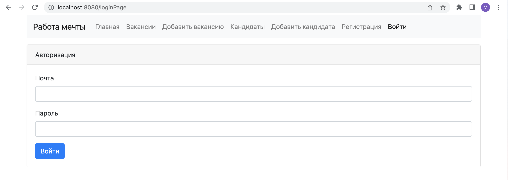
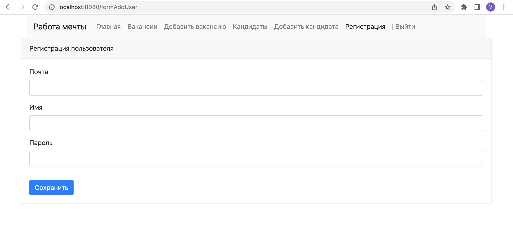
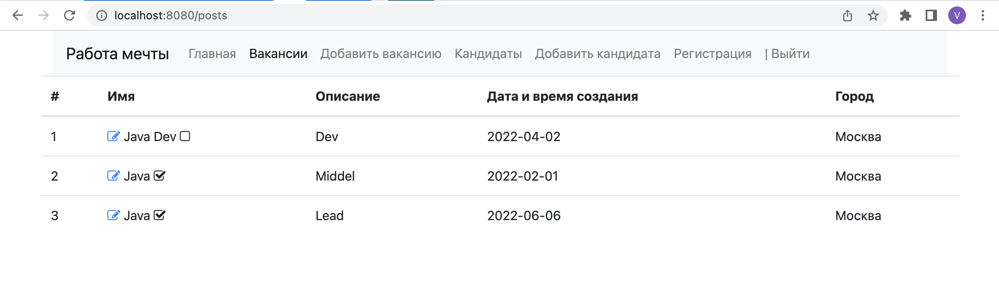
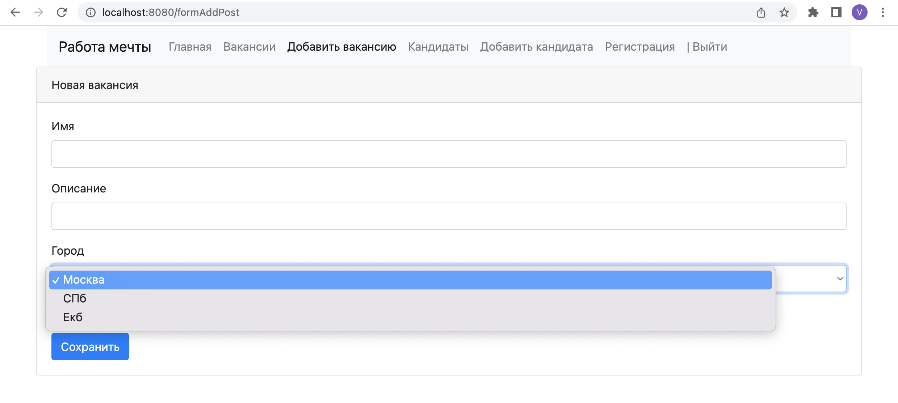
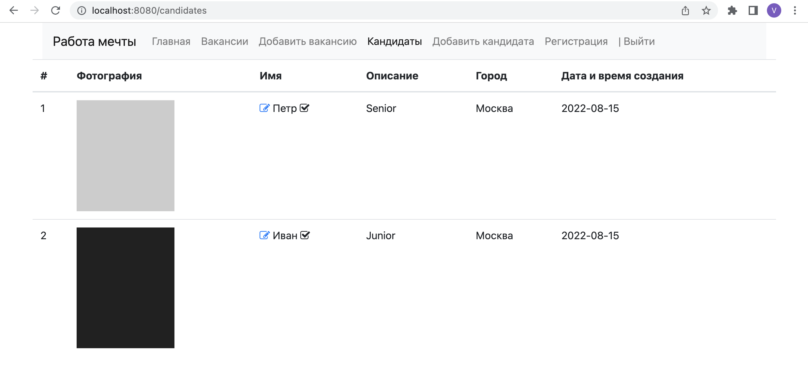
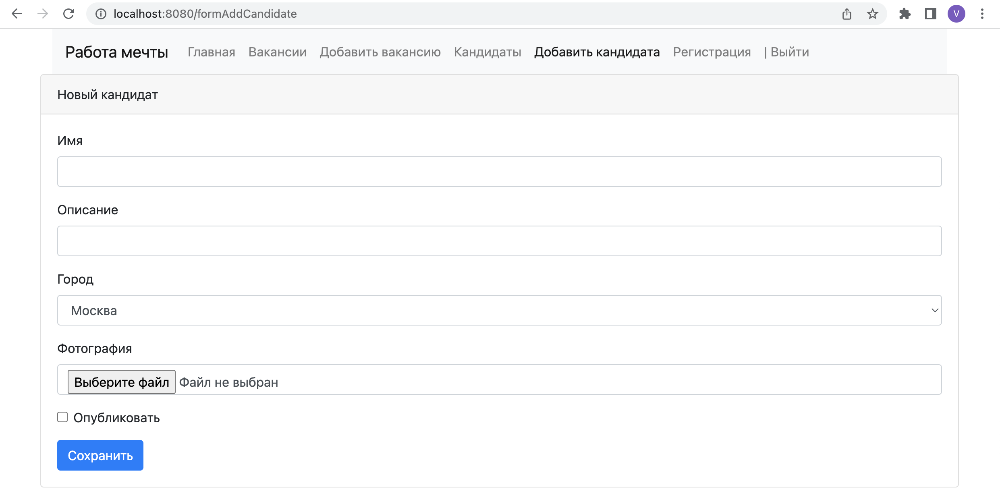
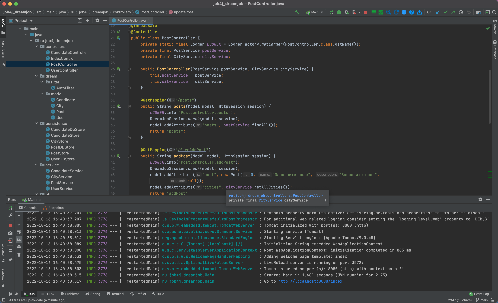

# job4j_dreamjob
Проект "Работа мечты"

## Используемые технологии

Веб приложение на языка Java с библиотекой Spring boot.

В системе две модели: вакансии и кандидаты. Кандидаты публикуют резюме. Кадровики публикуют вакансии о работе.

Кандидаты могут откликнуться на вакансию. Кадровик может пригласить на вакансию кандидата.

### Архитектура приложения трехслойное
- Слой контроллеры
- Слой сервисы
- Слой работы сс БД

### Скриншоты приложения

Страница авторизации:

Страница регистрации пользователя:

Страница с вакансиями:

Добавить вакансию с выбором города:

Страница с кандидатами:

Добавить кандидата с загрузкой фотографией:

Таблица пользователей из БД:

Таблица вакансий из БД:

Таблица кандиидатов из БД:

Среда разработки:

